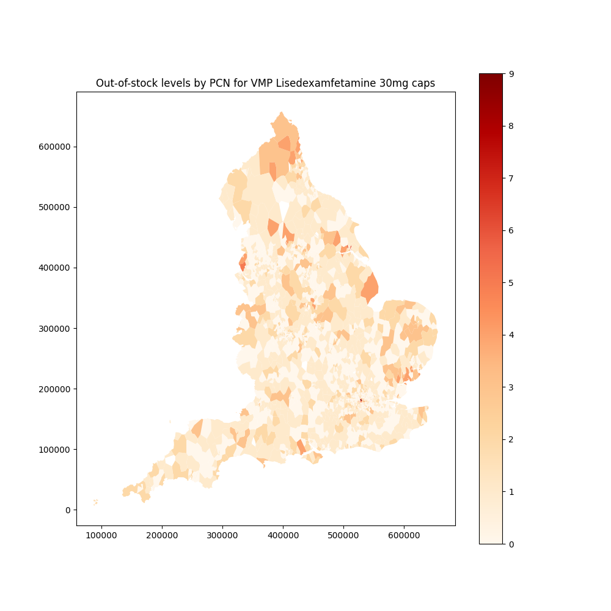
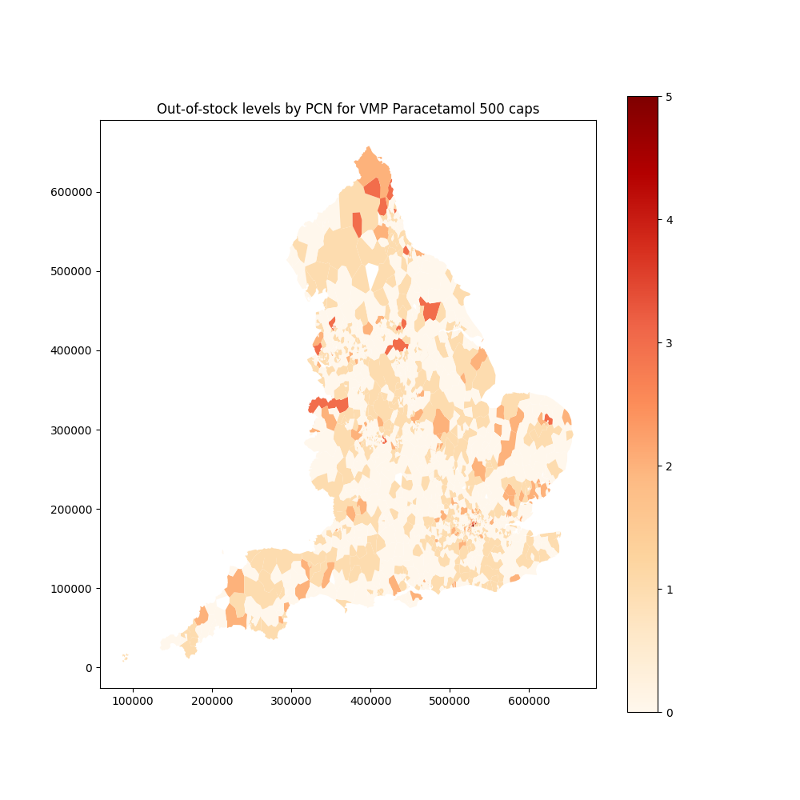

*Utrogestan 100mg: 61% green*

()
*Methylphenidate 27mg modified-release tabs: 39% green*

()
*Cefalexin 500mg capsules: 54% green*

()
*Atorvastatin 20mg tabs: 6% green*

()
*Cefalexin 500mg tablets: 44% green*

()
*Lisedexamfetamine 20mg caps: 14% green*

()
*Lisedexamfetamine 30mg caps: 2% green*

()
*Paracetamol 500 caps: 35% green*

()
*Ramipril 2.5mg caps: 13% green*

()